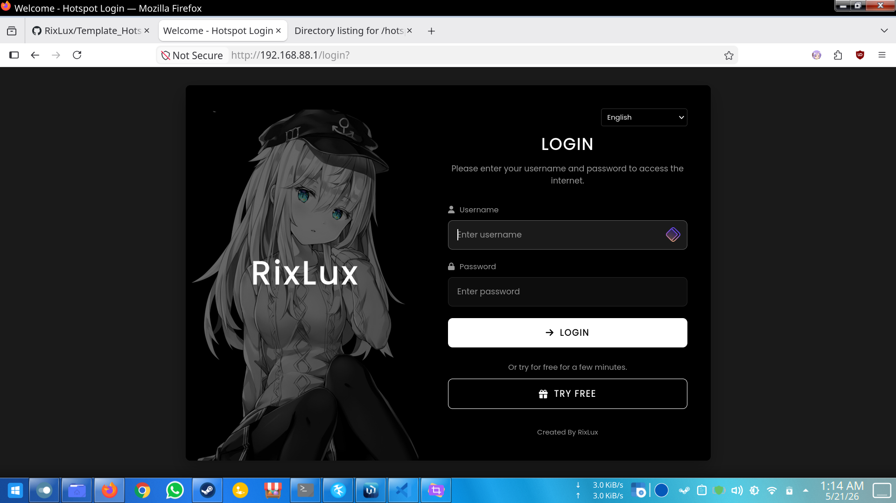
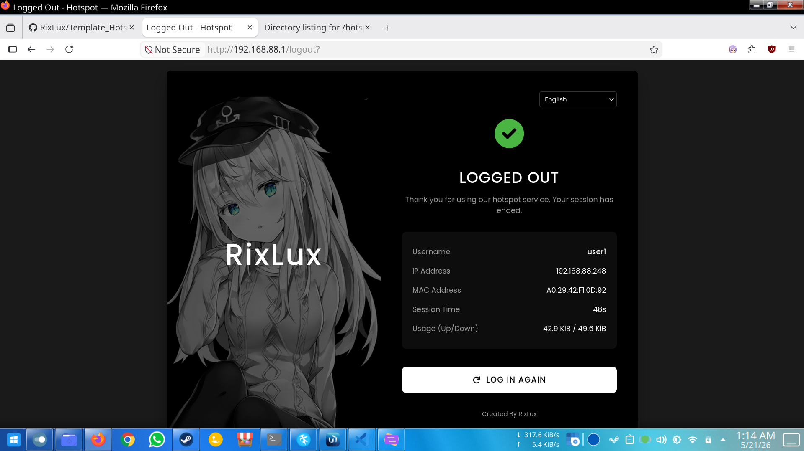
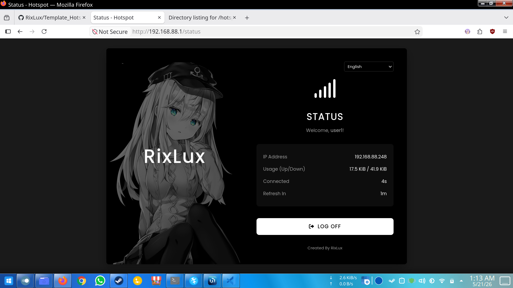

# Mikrotik Hotspot Template

A modern, minimalist dark-themed template for Mikrotik Hotspot, built with a focus on aesthetics and performance.

## Screenshots
  <details>
    <summary>Click to expand views</summary>
    
    
    
  </details>

## Design Philosophy

This template is built with **Low Memory** in mind. Most Mikrotik routers have very limited storage space. To keep the footprint as small as possible:
-   **CDN Usage:** High-quality fonts (Poppins) and icons (Font Awesome) are loaded via CDNs. This keeps the local file size under ~100KB.
-   **CSS-First:** Most of the visual effects are achieved through CSS rather than large image assets.

## Automated Patching (Online/Offline)

To make it easier to switch between **Online** (CDN-based) and **Offline** (local-based) modes, you can use the provided `patcher.py` script.

### Requirements
-   Python 3.x installed on your computer.

### How to use:

1.  **Switch to Offline Mode:**
    Run this command in your terminal:
    ```bash
    python patcher.py offline
    ```
    This will:
    -   Copy required assets from `offline_patch/` to the hotspot folder.
    -   Update all HTML files to use local Font Awesome.
    -   Update `login.css` to use local Poppins font.

2.  **Switch to Online Mode:**
    Run this command in your terminal:
    ```bash
    python patcher.py online
    ```
    This will:
    -   Revert all HTML and CSS files to use CDN links.
    -   Reduce the local footprint (ideal for low-memory routers).
    -   Remove all file that being copied from `offline_patch/`

### Why use a patcher?
-   **Online Mode:** Best for routers with very low memory (< 1MB available). It uses less than 100KB of local storage.
-   **Offline Mode:** Best for isolated networks or when you want the fastest loading speed without relying on external CDNs. Requires about 900KB of local storage.


## Features
-    Unified Style (Login, Logout, Status, Error, Advertisement)
-    Responsive Design (Mobile Friendly)
-    Modern Dark Theme
-    Lightweight and Fast
-    Multiple Languange Support by modifying `lang.js`

## Created By
[RixLux](https://github.com/RixLux)
